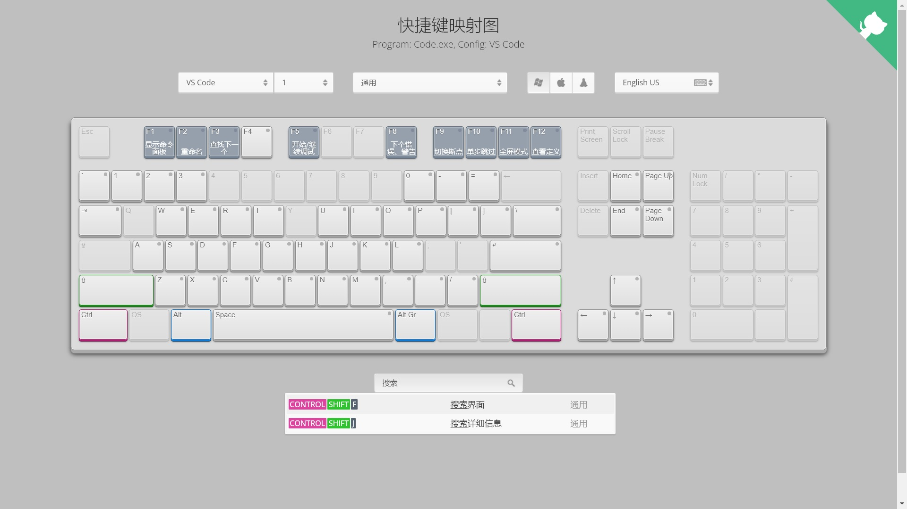

# Shortcut Mapper Chinese | 快捷键映射图

## ⭐ 简介

这是一个键盘快捷键可视化工具，将应用程序的 `快捷键` 映射到 `虚拟键盘` 上，以便查找和学习快捷键。 

本仓库包含两个分支，其中：
- `gh-pages` 用于github page服务；
    访问链接 https://tumuyan.github.io/ShortcutMapper_Chinese/ 即可使用，与上游仓库完全兼容
- `electron-app` 分支使用了electron对页面进行打包，额外实现了如下特性： 
    1. 双击程序 `ShortcutMapper.exe` 即可全屏显示快捷键。
    2. 按下热键 `Esc` 即可快速最小化窗口。
    3. 热键 `Win+Esc` 可最大化窗口。
    4. 使用热键最大化窗口时，根据按下热键时的前台程序的文件名，自动切换显示的快捷键配置为当前程序（支持一个程序对应多个文件名）。目前使用此功能需手动添加程序名到 `content\generated\app.js` 中，为每个程序添加 `file字段` 。



本仓库 fork 自 [HaujetZhao/ShortcutMapper_Chinese](https://github.com/HaujetZhao/ShortcutMapper_Chinese)，而 [ShortcutMapper_Chinese](https://github.com/HaujetZhao/ShortcutMapper_Chinese) 又 fork 自 [waldobronchart/ShortcutMapper](https://github.com/waldobronchart/ShortcutMapper)，欢迎前去支持。 


以下内容为原仓库说明  
----

  

## 📝 背景

总览

```
/content         网站内容
    /generated   包含生成的包含应用快捷键的 json/js 文件（以本网站格式储存）
    /keyboards   包含 html 键盘布局
    ...
/sources         每个应用快捷键的源文件、更新脚本
/shmaplib        Python 工具库，用于帮助导出快捷工具到 webapp 
/tests           Python 测试，确保没有错误
/utils           用于导出和测试的工具
index.html       主站点
```

## 🛠️ 贡献

### 在线访问

将本 repo fork 到 Github 或 Gitee，使用其 Pages 服务，即可在线访问。访问过一遍后，即使断网，也可以继续使用。

### 本地运行

本站的唯一一个页面就是 **index.html** ，理论上双击打开即可使用。

可是这个应用需要使用 ajax 请求，读取文件，以载入快捷键数据。

因为安全原因，ajax 从本地使用 file:// 协议时会失败，所以直接用浏览器从本地打开会失败。

因此本地运行需要使用这两种方法：

- 方法一：安装 Python 后，运行根文件夹下的 `启动.py`，就打开了。这个脚本会用用 HTTP 协议将本文件夹服务在本地 8000 端口上。只要在浏览器访问 `0.0.0.0:8000` 即可访问。这是**最简单**的方法，也是**最推荐**的。
- 方法二：按如下步骤设置一下浏览器（麻烦，**不推荐使用**）。

#### 设置浏览器

以 Windows 上的 Edge 浏览器为例，将 Edge 浏览器关闭后，在桌面上右击 Edge 浏览器图标，打开属性：


在 `目标` 一栏后面加上 `--allow-file-access-from-files` ：


点击确定，再启动 Edge 浏览器，用它打开 **index.html** 就可以正常显示快捷键了

### 新增应用快捷键

最好的例子是 `sources/windows` ，将这个文件夹复制一份，例如复制到  `sources/photoshop` ，打开该文件夹

一、编辑下 ` 01 生成中间文件.py` ，主要修改里面这句：

```python
idata = shmaplib.IntermediateShortcutData(app_name="Windows", version="10", default_context="通用")
```

例如改成：

```python
idata = shmaplib.IntermediateShortcutData(app_name="PhotoShop", version="cc", default_context="笔刷工具")
```

二、在 `sources/Vditor` 中你可以找到例子，将快捷键按以下格式填写到 `windows.csv` 和 `mac.csv` 中

```
情景    功能    按键1    按键3    ....
```

按键的标准名字你可以在 `shmaplib/keynames.py` 中找到，按键名字不用区分大小写。

Linux 的快捷键一般与windows相同，所以目前先忽略。

三、再运行 `01 生成中间文件.py`，就会生成 `intermediate.json`，检查下这个文件中有没有需要修改的错误，再运行 `02 将中间文件添加到正式目录.py`，就会将这个 app 的快捷键更新到 Shortcut Mapper 了。

## 🔋 打赏

项目 fork 自 https://github.com/waldobronchart/ShortcutMapper ，原版是英文版，欢迎前去支持

本软件完全开源，用爱发电，如果你愿意，可以以打赏的方式为我充电：


## 😀 交流

如果有软件方面的反馈可以提交 issues，或者加入 [QQ 群：1146626791](https://qm.qq.com/cgi-bin/qm/qr?k=DgiFh5cclAElnELH4mOxqWUBxReyEVpm&jump_from=webapi) 